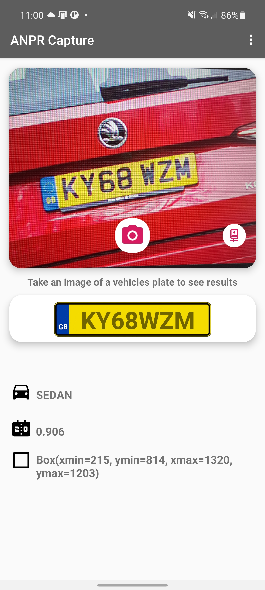

<div id="top"></div>
<!-- PROJECT LOGO -->
<br />
<div align="center">
  <h3 align="center">Plate Recognizer Android Example</h3>

  <p align="center">
    An android example application for automatic number plate recognition (ANPR) powered by platerecognizer.com API
    <br />
    <br />
    <a href="https://github.com/kjbaker-uk/platerecognizer-android-example/issues">🐛Report Bug🪲</a>
    ·
    <a href="https://github.com/kjbaker-uk/platerecognizer-android-example/issues">🆕Request Feature🆕</a>
    ·
    <a href="#changelog">🚗 Changelog 🚗</a>
  </p>
</div>


<!-- TABLE OF CONTENTS -->
<details>
  <summary>Table of Contents</summary>
  <ol>
    <li>
      <a href="#about-the-project">About The Project</a>
      <ul>
        <li><a href="#built-with">Built With</a></li>
      </ul>
    </li>
    <li>
      <a href="#getting-started">Getting Started</a>
      <ul>
        <li><a href="#installation">Installation</a></li>
      </ul>
    </li>
    <li><a href="#roadmap">Roadmap</a></li>
    <li><a href="#changelog">ChangeLog</a></li>
    <li><a href="#license">License</a></li>
    <li><a href="#contact">Contact</a></li>
  </ol>
</details>


<!-- ABOUT THE PROJECT -->
## About The Project

<p align="center">

</p>


This is a new and updated example Android application to demonstrate how to integrate Plate Recognizer API within your Android apps. This has been written from the ground up in Kotlin in a simple fragment-based app. It has been designed to allow you to extend the functionality in any way you need to. This project was made with the permission of the awesome people at Plate Recognizer to offer it freely to their customers. A free API was provided for development.

Features
- [X] Requires only the essential runtime permissions. 😁👍👌
- [X] Written in Kotlin.
- [X] Easy to extend the application for your own needs.
- [X] Clean and simple code with comments.

<p align="right">(<a href="#top">back to top</a>)</p>

### Built With

* [Android Studio](https://developer.android.com/studio)
* [Kotlin](https://kotlinlang.org/)👌
* [Plate Recognizer](https://platerecognizer.com/) ❤️

<p align="right">(<a href="#top">back to top</a>)</p>

<!-- GETTING STARTED -->
## Getting Started

### Installation

1. Clone the repo
   ```sh
   git clone https://github.com/kjbaker-uk/platerecognizer-android-example.git
   ```
3. Open in Android Studio.
4. Get a Snapshot Cloud API key from https://platerecognizer.com/
5. Edit "Anprfragment file and add your api key.


6. Run on a Android 11 device upwards.

<p align="right">(<a href="#top">back to top</a>)</p>

<!-- ROADMAP -->
## Roadmap

- [x] User testing
- [x] Release v1.0

<p align="right">(<a href="#top">back to top</a>)</p>

<!-- CHANGELOG -->
## Changelog
    
v1.0 

    Released app.

<p align="right">(<a href="#top">back to top</a>)</p>

<!-- CONTRIBUTING -->
## Contributing

Contributions are what make the open source community such an amazing place to learn, inspire, and create. Any contributions you make are **greatly appreciated**.

If you have a suggestion that would make this better, please fork the repo and create a pull request. You can also simply open an issue with the tag "enhancement".
Don't forget to give the project a star! Thanks again!

1. Fork the Project
2. Create your Feature Branch (`git checkout -b feature/AmazingFeature`)
3. Commit your Changes (`git commit -m 'Add some AmazingFeature'`)
4. Push to the Branch (`git push origin feature/AmazingFeature`)
5. Open a Pull Request

<p align="right">(<a href="#top">back to top</a>)</p>


<!-- LICENSE -->
## License

Distributed under the MIT License. See `LICENSE.txt` for more information.

<p align="right">(<a href="#top">back to top</a>)</p>


<!-- CONTACT -->
## Contact

Twitter: [@d4rkc00d3r](https://twitter.com/d4rkc00d3r)

Plate Recognizer: https://platerecognizer.com/contact/

Plate Recognizer API Docs: https://docs.platerecognizer.com/#introduction

Project Link: [https://github.com/kjbaker-uk/platerecognizer-android-exampler](https://github.com/kjbaker-uk/platerecognizer-android-example)


<p align="right">(<a href="#top">back to top</a>)</p>
